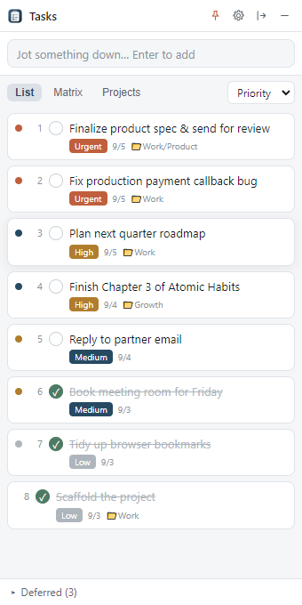
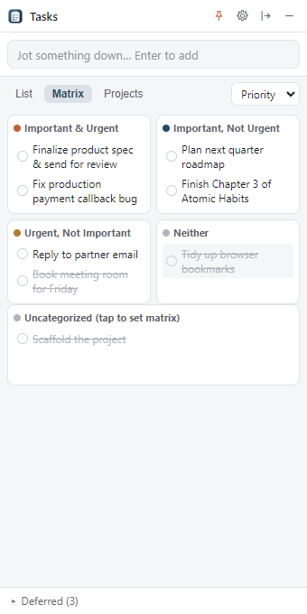
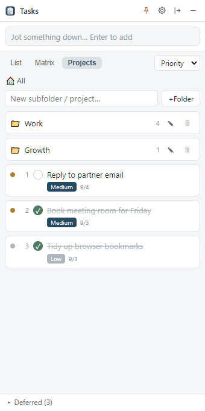

<div align="center">


# TaskList

**A lightweight personal to-do app that lives on your screen edge, jot things down instantly, stay clean and out of the way.**

Lightweight · Local storage · Clean light theme · Auto-hide on edge

**English** · [简体中文](README.zh-CN.md)

[](https://github.com/KehuiPang/tasklist/releases)
[](LICENSE)
[](https://github.com/KehuiPang/tasklist/releases)
[](https://www.electronjs.org/)

<br/>


</div>

---

## What is this

TaskList is a **personal to-do app built for everyday use**. It sits quietly on the edge of your screen, hover to expand, move away and it slides back. Perfect for a second monitor: capture whatever's on your mind, sort by importance/urgency, check things off, and see everything at a glance.

- 🪶 **Light**: all your data lives in a single local JSON file. No login, no network, no account, no ads.
- 🎯 **Focused**: a clean light interface that does one thing well: your personal to-dos, nothing bloated.
- 🔒 **Private**: everything stays on your machine (`%APPDATA%` / `~/Library` / `~/.config`), nothing is uploaded anywhere.

## Features

### 📝 Instant capture
- A top input box, **press Enter to add**. Capture a thought the moment it hits you, zero friction.

### 🗂️ Three ways to organize, switch anytime
| View | Description |
|------|------|
| **List** | The classic to-do list, one item after another |
| **Matrix** | The Eisenhower matrix (Important & Urgent / Important, Not Urgent / Urgent, Not Important / Neither) to sort out priorities |
| **Projects** | Organize tasks with projects + nested folders, grouped level by level |

### 🔀 Flexible sorting
- Sort by **priority**, by **date**, or **manually** drag to reorder, your call.

### ✅ Done sinks to the bottom
- Checking a task automatically **strikes it through and sinks it to the bottom**, keeping done and to-do cleanly apart.

### 💤 Deferred area
- Tasks you don't want to do right now but don't want to delete go into a collapsible **Deferred** area, out of sight, out of mind, back when you need them.

### 📌 Auto-hide on edge
- Snap the window to the screen edge and it **collapses into a thin strip**; hover to expand, move away to hide. Always there, never in the way.
- Choose the snap edge and whether to stay on top.

### 🎨 Clean light interface
- A soft palette of off-white/gray background, white cards, and indigo accents, easy on the eyes for long sessions.

### 🔃 Export / Import backup
- One-click export of all data to JSON, easy to back up, migrate, or move between machines.

### 🖱️ System tray
- Minimize to the tray; left-click to bring it back, right-click for a tidy menu (Show window / Always on top / Snap to edge / Quit).

## Screenshots

<div align="center">

| List | Matrix | Projects |
|:---:|:---:|:---:|
|  |  |  |
| One item after another, done tasks struck through | Eisenhower matrix, priorities at a glance | Projects + nested folders |

</div>

## Download & Install

Head to the [**Releases page**](https://github.com/KehuiPang/tasklist/releases) and download the latest build for your platform:

- **Windows**: `TaskList-Setup-x.x.x.exe`
- **macOS**: `.dmg` (Intel & Apple Silicon)
- **Linux**: `.AppImage` / `.deb`

## Run from source / Build

Requires [Node.js](https://nodejs.org/) (18+ recommended).

```bash
# Clone
git clone https://github.com/KehuiPang/tasklist.git
cd tasklist

# Install dependencies
npm install

# Run in dev
npm start

# Regenerate icons (optional, after editing the icon SVG)
node scripts/gen-tray.js

# Build a Windows installer (outputs to dist/)
npm run dist
```

## Data storage

All task data is kept in a single JSON file under your user directory:

```
Windows   %APPDATA%\tasklist\tasklist-data.json
macOS     ~/Library/Application Support/tasklist/tasklist-data.json
Linux     ~/.config/tasklist/tasklist-data.json
```

To back up or migrate, just copy this file, or use the built-in Export / Import.

## Tech stack

- [Electron](https://www.electronjs.org/): desktop app framework
- Vanilla HTML / CSS / JavaScript: no heavy frontend framework, lean and direct
- Local JSON file storage: zero backend, zero service dependencies
- [electron-builder](https://www.electron.build/): packaging installers
- GitHub Actions: push a tag to auto-build and publish a Release

## Version

**Current: v1.0.0** (first public release)

- ✅ List / Matrix / Projects, three views
- ✅ Quick capture, sort by priority/date/manual
- ✅ Done tasks struck through & sunk, Deferred area
- ✅ Auto-hide on edge + hover to expand
- ✅ Clean light UI, system tray, import/export
- ✅ Local JSON storage
- ✅ English & 简体中文 (auto-detects your system language, switchable in-app)

See the [Releases](https://github.com/KehuiPang/tasklist/releases) for the changelog.

## Contributing & Feedback

Feel free to open an [Issue](https://github.com/KehuiPang/tasklist/issues) for bugs or feature ideas, and PRs are very welcome. If this little tool helps you, a ⭐ Star is the best encouragement 😊

## License

Released under the [MIT License](LICENSE), free to use, modify, and distribute (including commercially).

---

## Made by the Wuwei team

TaskList is a small tool built by the team behind **[Wuwei AI](https://wuweiai.io)**, a **free, open-source, local-first AI agent client**.

Think Claude Code or Cursor, but free, open-source, and model-agnostic: tell it what you want in one sentence and it reads/writes files, makes precise edits, runs commands, and searches the web to get the job done, with every step behind a permission prompt. Switch between Claude / OpenAI / Chinese LLMs in one click; bring your own API key or use Wuwei's hosted credits (works free, even without login).

👉 **[Try Wuwei AI at wuweiai.io](https://wuweiai.io)** · free & open source, Windows / macOS / Linux
